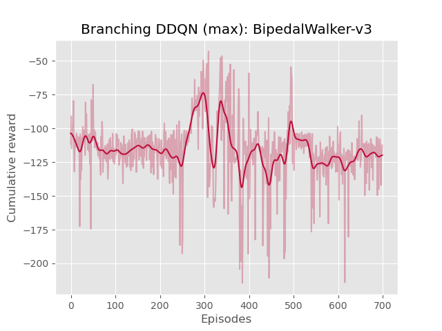

# Action Branching Deep Q-Networks

This repository proposes a PyTorch implementation of the Branching Dueling Q-Network (BDQN), based on the paper [https://arxiv.org/pdf/1711.08946.pdf](https://arxiv.org/pdf/1711.08946.pdf). With BDQN, a Q-Learning agent can be trained to select multiple actions at the same time. This method can be used for continuous control. The architecture is illustrated below:


## Installation

- Start by cloning this repository.
- This project uses Python 3.7 and the following packages:
```bash
torch==1.6.0
torchvision==0.7.0
tensorboard==2.3.0
numpy==1.18.5
pandas==1.1.1
matplotlib==3.3.1
gym==0.17.2
```

## Use

To train an agent, use the following command:
```bash
python train.py config.json
```

To visualize the trained agent, use the following command:
```bash
python play.py config.json
```

## Performances and Results

The authors propose three methods to generate the temporal-difference (TD) targets:

1) Calculate a TD target for each individual action dimension separately
2) Using the maximum TD target over the action branches as a global learning target
3) Using the mean TD target over the action branches as a global learning target

### Individual action


| Episode 1 - Reward: 283.06  | Episode 2 - Reward: 276.89 | Episode 3 - Reward: -114.10 | Episode 4 - Reward: 279.77 | Episode 5 - Reward: 279.70 |
|:---:|:---:|:---:|:---:|:---:|
|  |  |  |  | 

### Maximum



| Episode 1 - Reward: -124.92  | Episode 2 - Reward: -137.62 | Episode 3 - Reward: -124.91 | Episode 4 - Reward: -124.90 | Episode 5 - Reward: -125.08 |
|:---:|:---:|:---:|:---:|:---:|
|  |  |  |  | 

### Mean


| Episode 1 - Reward: 95.59  | Episode 2 - Reward: 91.76 | Episode 3 - Reward: -8.95 | Episode 4 - Reward: 27.09 | Episode 5 - Reward: 119.73 |
|:---:|:---:|:---:|:---:|:---:|
|  |  |  |  | 

## Custom Configuration

You can change your configuration for training and evaluation by changing the `config.json` file. The only special field is the `temporal_difference_target` which can take one of these values: `mean`, `max` or `individual`.

## Original Tensorflow implementation

The original Tensorflow implementation is available on the authors's Github ([https://github.com/atavakol/action-branching-agents](https://github.com/atavakol/action-branching-agents)).
